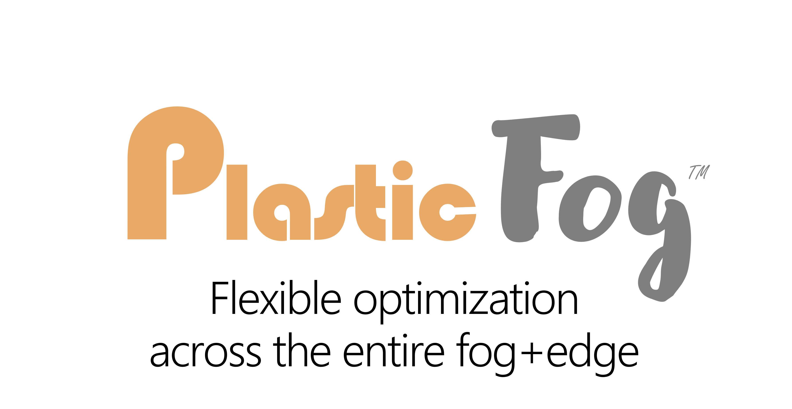

<!-- dc:status=polished dc:owner=DC1 -->

PlasticFog is a framework for widely-distributed decomposition-based
optimization. It supports:

- **Widely-distributed nested decomposition with mixed methods.** The supported
  methods currently include price-directed (Dantzig–Wolfe column generation, via
  COIN-OR DIP) and resource-directed (Benders, via a custom C++ implementation).
  These can be sub-hierarchies within the same decomposed overall problem. This
  approach is ideal for industrial infrastructure, e.g. where a price-directed
  decomposition solution manages manufacturing lines across an entire factory
  floor while lower-level nested resource-directed sub-hierarchies manage robots
  within cells — directly on cell controller nodes and robot-hosted subproblem
  nodes — all as a single wholistic overall problem. For more information, see
  [Decomposition paradigms](architecture/decomposition.md).
- **Dynamic updates to a problem definition.** These updates
  can include changes to: a) the physical and logical decomposition topology,
  b) the mathematical logic at the nodes, c) the solver selections per node, and 
  d) the decomposition
  methods. Updates are applied per sub-hierarchy. Changes to mathematical logic and data can be applied even while the targeted sub-hierarchy is running — affected nodes recompile the model in memory and re-enter at safe points in their iteration cycles — while changes to topology, solvers, or methods are applied between that sub-hierarchy's solves. In every case the wider problem can continue to run. 
  This feature supports spot updates where, for example, two factory
  cell controller sub-hierarchies could be modified as a mobile robot subproblem
  moves from one cell to the other, while the overall factory optimization
  process runs continuously. Note that processing at any master or mid-master node (within
  the nested hierarchy) can be stopped, paused, and resumed independently. A paused child is
  resolved by its parent's failure policy rather than waited out.
  Where the parent's policy tolerates the pause, a paused sub-hierarchy's mathematical logic and data can be updated in place and the sub-hierarchy resumed on the updated definition, while the wider problem continues to run. End-to-end testing of this composed sequence is still underway in this pre-release.
- **Speculative farming with cuOpt.** This is an innovative widely-distributed
  approach to leveraging the combined capabilities of accelerated inexact and
  traditional exact solver methods that extends beyond current approaches
  including any current research of which we are aware.
  [Speculative farming](speculative-farming/index.md) explains the mechanism,
  and [Competitive analysis](speculative-farming/competitive.md) states the
  novelty claim as carefully as the record allows.
- **Hardened real-world framework.** This includes OMG standard Data
  Distribution Service (DDS) transport, COIN-OR solvers and frameworks,
  consistent error handling, and hundreds of regression tests (see
  [Quality & testing](quality/index.md)) in this pre-release, with planned
  support for security plugins, enhanced fault handling, and abstraction layers
  that will support industrial connectivity and plugins, e.g. for additional AI
  models, mathematical solvers, networking transport standards, and more. The
  PlasticFog platform is written entirely in C++17. One goal is to provide a
  pathway for research projects to be immediately deployed into real-world
  solutions.
- **Prompt packs enabling LLM generation of widely-distributed problem
  definitions.** A model-neutral prompt pack turns a description of a problem
  into a schema-valid problem definition. One pack is provided per input mode:
  prose, a written mathematical formulation, a model in another algebraic modelling language such as AMPL or GAMS, a flat Zimpl model you already run under one solver, or a patch to a definition already submitted (known as a
  spot update). A request may carry an explicit decomposition or a hint at how
  the decomposition structure should be constructed. The prompt pack checks any
  hint rather than simply obeying it. All input formulations are converted to
  PlasticFog's internal customized Zimpl format which encodes widely-distributed nested 
  decomposed problems in a manner that can be rapidly processed. This technology does not claim to robustly
  discover decomposition structures within models written to be solved whole,
  but rather records them as assumptions. This could be a potential area for
  research, however. [Authoring with an LLM](guide/llm-authoring.md) describes
  the protocol by which generated definitions are evaluated. LLM generation of
  problem descriptions has been formally tested on Claude Fable 5 at this
  writing. ChatGPT Pro testing is expected to be completed soon.
- **A command-line workbench.** The `pf` command validates and catalogs problem
  definitions, plans and starts a deployment, submits a definition to it, and
  follows the results and logs that come back. It drives `pf_Conductor`, a
  resident daemon it starts itself when one is not already running.
  [Workbench reference](guide/workbench.md) lists the verbs.
- **A generalized application, out of the box.** `pf_App` takes a problem
  definition, resolves its required PlasticFog services nodes against the live
  registry, publishes the graph that defines a problem's topology and logic, and
  waits for the results envelope, so no application code is written per problem
  — [Application flow](architecture/app-flow.md) follows one run through it.
  Starting the services is the conductor's job rather than the application's:
  `pf deploy` plans and spawns a local constellation of PlasticFog services, and
  `pf logs` presents what those services write, fanned into one stream or one
  terminal per service. Remote PlasticFog services can be started manually, and
  it is expected that this will work properly, although thorough testing of this
  capability is still underway in this pre-release.
- **Parallel subproblems** are supported via a small update to COIN-OR DIP.
  Although DIP currently provides an optional thread-based mechanism for handling local
  parallelization of subproblems, this approach isn't appropriate for
  PlasticFog. A complementary (and fully atomic) additional API call enables
  PlasticFog to retrieve the entire reduced costs vector for all subproblems in one batch per
  iteration. PlasticFog handles all of the parallelization, and returns the
  results as a batch. Note that a subset of subproblems could potentially be
  solved locally by DIP using the thread-based parallelization approach, while
  PlasticFog solves a disjoint set of subproblems remotely via its own
  parallelization approach.

## How it works

PlasticFog takes a problem that has been cut into a coordinating master and a
set of subproblems, and it runs that decomposition as a set of long-lived,
independently placed services that coordinate over a real network — rather than
as a loop inside one process. The decomposition itself is the contract: which
rows stay at the master, which index separates the blocks, which symbols cross
a boundary and who owns them are stated in a schema-validated document, not
inferred from a model file.

Two properties distinguish it from a decomposition library. First, paradigms
compose. A node's decomposition paradigm is a **local** decision: a
price-directed (Dantzig–Wolfe) parent does not know or care that its child is a
resource-directed (Benders) master, and coupling is adjacent-level-only, so a
hierarchy stays comprehensible as it deepens. Second, placement is a runtime
question rather than a build-time one. A problem definition names service
types, counts and capabilities; the runtime resolves those against a live
registry, refuses what it cannot execute, and distributes what it can.
Solver engines are selected per boundary, and a request for an engine a host
cannot actually run is refused with a stated reason rather than silently
downgraded.

### What runs today

Four decomposition shapes execute end to end, each checked against an
independently derived optimum rather than against itself: flat price-directed,
nested price-directed through an intermediate node that is master and
subproblem at once, flat resource-directed, and the mixed shape — a
price-directed root over a resource-directed intermediate node.

Around them sits the rest of a working system: a live control plane that can
pause, resume, stop and start a run and request results from it; updates
applied to a constellation that is already running, redistributing only what
changed; failure policies that resolve a missing child by name; per-master
results scoping; in-process model compilation; and a command-line workbench
over a resident daemon that plans deployments, owns the processes it starts,
schedules repeated runs, and keeps a results and log plane.

What the framework will not do is claim more than that. Shapes it cannot yet
execute are refused before anything is published, by name, and the refusals are
held in place by tests that assert the exact code or the exact message — so a
capability cannot be widened by accident without something failing. Where the
runtime finishes with a bound it has not closed, it reports `feasible` and a
gap rather than `optimal`. The
[known limits](architecture/decomposition.md#known-limits) are documented on
the same page as the shapes they qualify.

## Status

**PlasticFog is pre-release.** It is built from source; there is no published
package yet, and the repository at
[github.com/stanmanwplan/PlasticFog](https://github.com/stanmanwplan/PlasticFog)
hosts this documentation today. Interfaces — the problem-definition schema,
the results envelope, the wire types and the command-line verbs — are still
moving, and this documentation describes the state of the tree rather than a
released version. The source release will land at that same address, along
with the clone and download locations.

The framework is Linux-targeted, C++17, and built on OpenDDS for transport and
COIN-OR for the decomposition and solver machinery, with HiGHS linked in and
NVIDIA cuOpt reached optionally at run time.

## Where to go next

[Installation](getting-started/installation.md) covers the build as it exists
today, and [Your first problem](getting-started/first-problem.md) walks the
whole path once — author, validate, submit, read results.
[Application flow](architecture/app-flow.md) and the rest of the Architecture
section describe what the runtime does with a document, service by service and
state by state. [Upcoming features](roadmap/index.md) names every planned item
as owed, deferred or unbuilt.
[Speculative farming](speculative-farming/index.md) is the part of the system a
solver researcher is most likely to want first: candidate columns farmed by
inexact engines while exact engines certify them, with the resulting proof
obligations tracked explicitly rather than assumed away.
